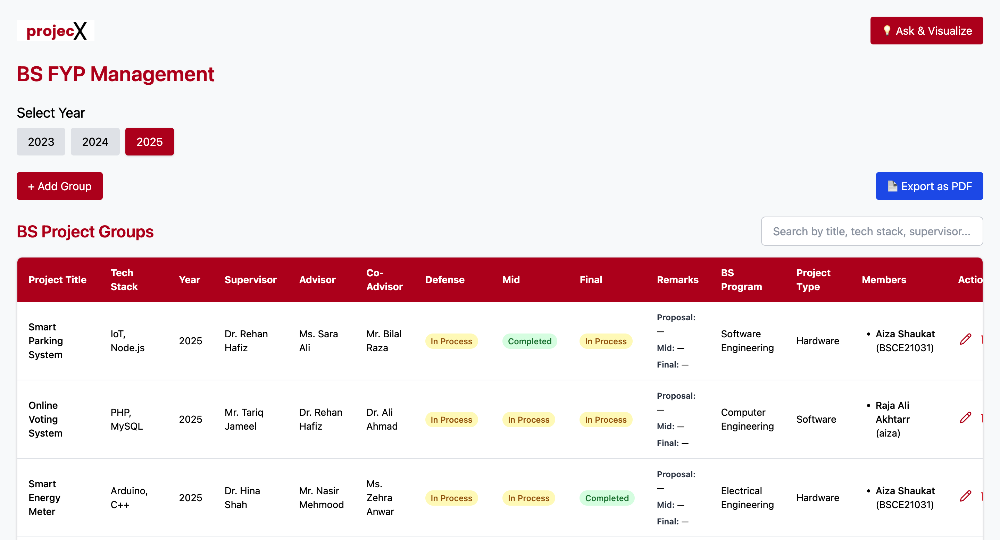
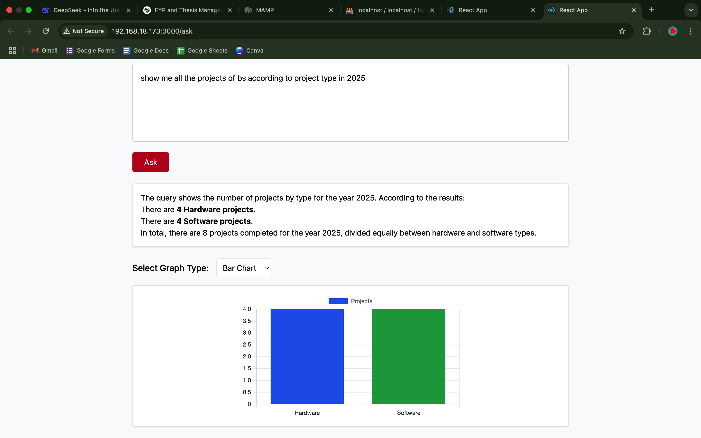

## ProjectX – AI-Powered FYP & MS Thesis Management System


---

## 📄 Abstract

**ProjectX** is a full-stack academic project management platform designed to streamline and digitize the workflows of BS Final Year Projects and MS Theses in universities. It provides:

* Centralized group and thesis tracking
* Document submission handling for proposal, mid, and final stages
* Real-time evaluation status tracking
* AI-powered natural language querying that converts queries into SQL
* Visual reports (Bar, Pie, Line charts) with downloadable PDF exports

---

## 📸 Screenshots

| Ask & Visualize                         | Dashboard                                     |
| --------------------------------------- | --------------------------------------------- |
|  |  |

---

## 📚 Table of Contents

* [Features](#features)
* [Tech Stack](#tech-stack)
* [Folder Structure](#folder-structure)
* [Setup Guide](#setup-guide)
* [Using the AI Query Tool](#using-the-ai-query-tool)
* [Database Setup](#database-setup)
* [Usage Examples](#usage-examples)
* [Known Issues](#known-issues)
* [Contributing](#contributing)
* [License](#license)
* [Contact](#contact)

---

## ✨ Features

* 👥 Group creation with multiple students
* 📃 Complete CRUD operations for FYP and Thesis data
* 📎 Document upload and status tracking (Proposal, Mid, Final)
* 🧐 AI-Powered Query Handling via OpenAI API
* 📊 Chart.js visualizations (bar, pie, line)
* 📤 Export results as professional PDFs
* 🔍 Search and filter project data

---

## 🧰 Tech Stack

| Layer         | Technology             |
| ------------- | ---------------------- |
| Frontend      | React.js, Tailwind CSS |
| Backend       | Node.js, Express, PHP  |
| Database      | MySQL (via MAMP)       |
| AI Engine     | OpenAI GPT (API based) |
| Visualization | Chart.js               |
| Export        | html2pdf.js            |

---

## 📁 Folder Structure

```bash
projecx/
├── api/                     # PHP backend
│   ├── query.php            # NLP to SQL
│   ├── ms_thesis.php        # MS Thesis API
│   └── DbConnect.php        # DB connection
├── frontend/                # React frontend
│   ├── src/
│   │   ├── pages/           # Page views
│   │   ├── components/      # Reusable components
│   │   ├── assets/          # Images, videos, logos
│   │   └── App.js           # Main app logic
├── public/
│   └── assets/              # ITU and ProjectX logos
└── README.md
```

---

## 🚀 Setup Guide

### 📦 Prerequisites

* Node.js v18+
* MAMP (Apache + MySQL)
* PHP 7+
* MySQL via phpMyAdmin
* OpenAI API Key

### ⚙️ Installation

```bash
git clone https://github.com/AizaShaukat/projecx.git
cd projecx
```

### 🔌 Frontend Setup

```bash
cd frontend
npm install
npm start
```


---

### 💻 Backend Setup

#### 📁 Step 1: Place the Backend Files

* Copy the `api/` folder from this repository into your **MAMP `htdocs` directory**.

  **Default MAMP `htdocs` paths:**

  * **macOS**:
    `/Applications/MAMP/htdocs/`
  * **Windows**:
    `C:\MAMP\htdocs\`

---

#### ⚙️ Step 2: Start MAMP Servers

1. Open **MAMP** application.
2. Click **Start Servers** (This will start **Apache** and **MySQL**).

---

#### 🌐 Step 3: Test Backend Connection

* Open your browser and go to:

  ```
  http://localhost:80/api/query.php
  ```

* If it's working correctly, you should see a blank page or message (depending on your PHP logic).

---

#### 🌐 Step 4: Open AI API Key

* Open api/query.php and go to line 41:

  ```
  $openAiApiKey = 'your-api-key'; //insert your open ai api key here
  
  ```


---

#### 🗂️ Additional Notes:

* Ensure that the `query.php`, `ms_thesis.php`, and other scripts are placed correctly inside the `api/` folder.
* Your MySQL database (e.g., `fyp_management`) should already be imported via **phpMyAdmin**.

  * macOS: [http://localhost/phpMyAdmin](http://localhost/phpMyAdmin)
  * Windows: [http://localhost/phpmyadmin](http://localhost/phpmyadmin)
* Update database credentials in `api/DbConnect.php` if needed:

```php
$this->user = "root";
$this->password = ""; // Use "root" for Windows MAMP if default doesn't work
```

---


## 🧐 Using the AI Query Tool

1. Navigate to **Ask & Visualize** tab
2. Enter a query like:

   ```
   Show all completed BS projects for 2025
   ```
3. The system:

   * Sends to OpenAI
   * Converts to SQL
   * Queries MySQL database
   * Displays visual chart & text answer
   * Exportable as PDF

---

## 📊 Database Setup

* Import `projecx.sql` via phpMyAdmin
* Tables:

  * `groups`, `group_members`, `ms_thesis`
  * Fields include:

    * project\_title, tech\_stack
    * advisor, co\_advisor
    * proposal\_file, mid\_file, final\_file
    * document statuses: Incomplete / In Process / Completed

---

## 🔄 Usage Examples

* List all projects using Node.js
* Filter theses with advisor "Dr. X"
* Count FYPs in 2024 with "React" tech stack
* Visualize status of document submissions

---

## 🚫 Known Issues

* OpenAI may return incorrect SQL
* Long queries may timeout (retry)
* `.env` secrets must be hidden before pushing to GitHub

---

## 👤 Contributing

```bash
git clone https://github.com/your-username/projecx.git
git checkout -b feature/something
# make changes
# commit & push
```

Submit a pull request with a detailed description of your changes.

---

## 📄 License

MIT License. See [LICENSE](./LICENSE).

---

## 📩 Contact

* Aiza Shaukat
* Email: [aizashaukat29@gmail.com](mailto:aizashaukat29@gmail.com)
* GitHub: [@AizaShaukat](https://github.com/AizaShaukat)

---
